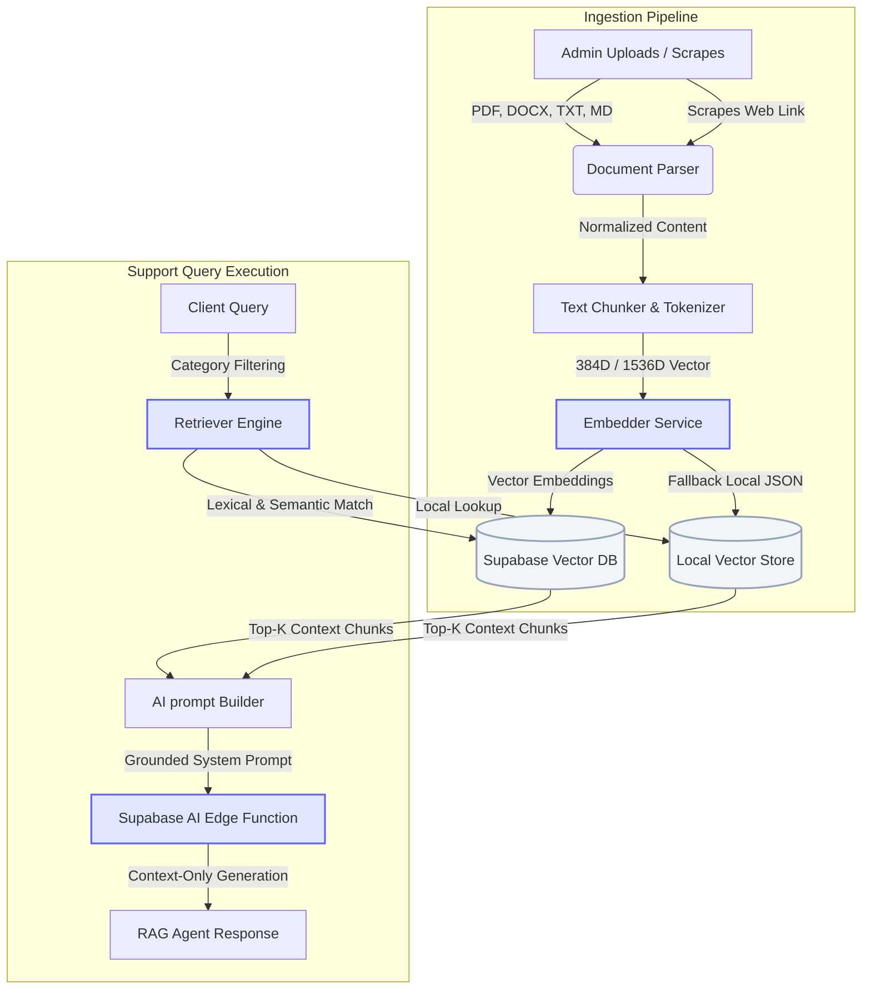

# 🧠 Neural RAG Support Suite

<div align="center">

[](https://ragsupportsuite.netlify.app/)
[](https://www.typescriptlang.org/)
[](https://react.dev/)
[](https://nodejs.org/)
[](https://supabase.com/)

<p align="center">
  A premium full-stack, corporate-ready RAG customer support chatbot and knowledge management system. 
  It parses business documentation, runs hybrid search over multi-format vectors, and deploys high-accuracy answers exclusively grounded in your business data.
</p>

</div>

---

## 🧭 System Architecture

The following diagram illustrates how user queries are processed and how internal documentation is ingested, embedded, and retrieved inside the RAG workflow:



---

## ✨ Core Features

*   **⚡ Neural Knowledge Ingest**: 
    *   **Drag-and-Drop Area**: Drop zones that visually react to hovering files (supports PDF, DOCX, TXT, and Markdown).
    *   **Raw Text Editor**: Stateful pasted intake panel featuring character allocation meters.
    *   **Website Scraper**: Pulls clean text content from external URLs by removing boilerplate HTML tags.
*   **🔍 Hybrid Context Retriever**: Combines lexical overlap calculations with cosine semantic embedding similarity, applying department categories (HR, Operations, Accounts, IT, Sales) to filter out irrelevant information.
*   **🛡️ Multi-Provider Embedding Fallback**: Uses OpenAI `text-embedding-3-small` whenever keys are provided, defaulting automatically to an offline deterministic vector hash mechanism for zero-dependency local builds.
*   **💬 Modern Helpdesk Panel**: Sleek Stripe-style chat bubbles, live context citation badges, optional operator email tracking, and automatic ticket generation under strict RAG boundaries.
*   **🏢 Corporate Admin Studio**: Top-level stats (character count, indexed documents, updates), workspace visibility parameters, real-time index databases, and tenant configuration dashboards.

---

## 🛠️ Technology Stack

| Layer | Technologies & Libraries |
| :--- | :--- |
| **Frontend** | React 18, TypeScript, Vite, Tailwind CSS, Lucide Icons |
| **Backend** | Node.js, Express, TypeScript, Multer, Axios |
| **Database & Auth** | Supabase DB, GoTrue Auth Client |
| **RAG Ingestion** | `pdf-parse`, `mammoth` (Word/DOCX), native HTML parser |
| **Embeddings & AI** | OpenAI API, Supabase Edge Functions (`/functions/v1/ai-chat`) |

---

## ⚡ Quick Start

### 1. Install Dependencies
Run the install script in the root directory to set up both frontend and backend modules:
```bash
npm run install:all
```

### 2. Configure Environment Variables
Create the backend configuration file at `backend/.env` using the following schema:
```env
# Supabase AI Edge Function Config
SUPABASE_AI_CHAT_URL=https://your-project-id.supabase.co/functions/v1/ai-chat
SUPABASE_AI_API_KEY=your_supabase_anon_key
AI_PROVIDER=openrouter
AI_MODEL_ID=your_ai_model_id
AI_TOKEN_SLOT_ID=your_ai_token_slot_id

# Database Config
SUPABASE_URL=https://your-project-id.supabase.co
SUPABASE_ANON_KEY=your_supabase_anon_key
SUPABASE_SERVICE_ROLE_KEY=your_supabase_service_role_key

# OpenAI (Optional - Falls back to local embeddings if empty)
OPENAI_API_KEY=
```

Create the frontend config file at `frontend/.env.local`:
```env
VITE_API_URL=http://localhost:3001
VITE_SUPABASE_URL=https://your-project-id.supabase.co
VITE_SUPABASE_ANON_KEY=your_supabase_anon_key
```

### 3. Deploy Database Schema
Execute the commands in [supabase/schema.sql](./supabase/schema.sql) using your Supabase SQL editor. It initializes the database schema, creates storage parameters, and establishes tables for RAG documents.

> [!NOTE]
> The first user who registers after schema deployment is automatically granted `admin` credentials.

### 4. Run Development Servers
Start both backend node instances and the frontend Vite server in parallel:
```bash
npm run dev
```
The client dashboard runs locally at `http://localhost:5175`.

---

## 📂 Key Directory Layout

*   [`frontend/src/components/AdminDashboard.tsx`](file:///d:/SOFTWARE/ANTIGRAVITY/AI%20customer%2520support%2520chatbot/frontend/src/components/AdminDashboard.tsx): Admin Control Panel (Ingestion, metrics, and configurations).
*   [`frontend/src/components/CustomerChat.tsx`](file:///d:/SOFTWARE/ANTIGRAVITY/AI%20customer%2520support%2520chatbot/frontend/src/components/CustomerChat.tsx): Customer portal and conversational AI interface.
*   [`backend/src/routes/knowledge.ts`](file:///d:/SOFTWARE/ANTIGRAVITY/AI%20customer%2520support%2520chatbot/backend/src/routes/knowledge.ts): Express routes handling text, link, and file uploads.
*   [`backend/src/services/embedder.ts`](file:///d:/SOFTWARE/ANTIGRAVITY/AI%20customer%2520support%2520chatbot/backend/src/services/embedder.ts): Batch embedding dispatchers with local hash fallbacks.
*   [`backend/src/services/knowledge.ts`](file:///d:/SOFTWARE/ANTIGRAVITY/AI%20customer%2520support%2520chatbot/backend/src/services/knowledge.ts): Chunker split algorithms and hybrid DB queries.

---

## 🔌 API Reference

### Chat Ingestion
*   **URL**: `/api/chat`
*   **Method**: `POST`
*   **Body Schema**:
    ```json
    {
      "message": "What is the company leave policy?",
      "category": "HR",
      "customerEmail": "operator@company.com",
      "conversationHistory": []
    }
    ```
*   **Response Schema**:
    ```json
    {
      "answer": "All corporate employees are allotted 24 paid annual leave days...",
      "sources": ["Employee Handbook v1.pdf"],
      "ticketId": "a1b2c3d4-e5f6-7a8b-9c0d-1e2f3a4b5c6d"
    }
    ```

### Ingest Plain Text
*   **URL**: `/api/knowledge/text`
*   **Method**: `POST`
*   **Headers**: `Authorization: Bearer <access_token>`
*   **Body Schema**:
    ```json
    {
      "category": "IT support",
      "title": "VPN Setup Tutorial",
      "contentText": "To connect to the corporate network, install Cisco..."
    }
    ```

### Ingest Scraped Link
*   **URL**: `/api/knowledge/link`
*   **Method**: `POST`
*   **Headers**: `Authorization: Bearer <access_token>`
*   **Body Schema**:
    ```json
    {
      "category": "Operations",
      "url": "https://docs.company.com/shipping-guidelines",
      "title": "Shipment Routing Process"
    }
    ```
